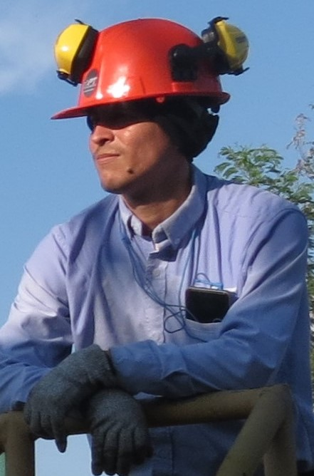
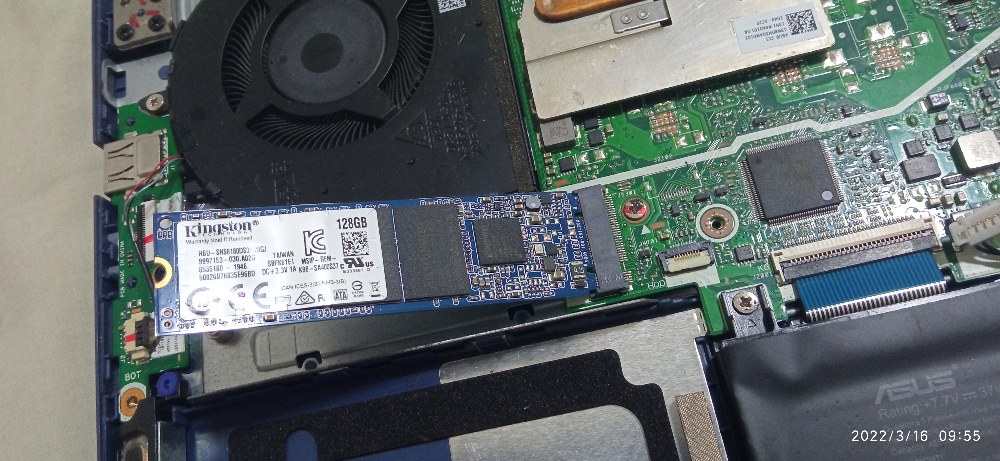

# Roymer Javier López Castro
### ⚡ Electronic Engineer · Telecom Specialist · Full-Stack Developer

---

| 🗓️ **10 años** de experiencia | 📁 **+104 proyectos** completados | 😊 **100 clientes** satisfechos |
|:---:|:---:|:---:|

---

## 👤 Perfil Profesional

Ingeniero Electrónico especializado en **gestión de proyectos**, con amplia trayectoria en telecomunicaciones, diseño digital y analógico. Cuento con:

- 🔧 **9 años** en telecomunicaciones y diseño digital
- 💻 **4 años** de experiencia en programación (Go, JavaScript, Kotlin, Java)
- 🏗️ **4 años** supervisando proyectos de automatización
- 🍽️ **2 años** desarrollando software para restaurantes, hoteles y puntos de venta

Manejo plataformas como **Docker**, **GitHub** y **Heroku** para despliegue y control de versiones.

---

## 🛠️ Habilidades Técnicas

### Desarrollo de Software

| Tecnología | Nivel |
|---|---|
| HTML / CSS | ████████░░ Medio |
| JavaScript | ████████░░ Medio |
| Go (Golang) | ████████░░ Medio |
| Kotlin | ████████░░ Medio |
| Java | ████████░░ Medio |
| VHDL / Assembler | ████████░░ Medio |
| Bases de datos (PostgreSQL) | ████████░░ Medio |

### Telecomunicaciones & Electrónica

| Habilidad | Nivel |
|---|---|
| Apuntamiento de antenas satelitales | ██████████ Avanzado |
| Configuración de equipos de red | ██████████ Avanzado |
| Diseño de redes estructuradas | ██████████ Avanzado |
| Diseño electrónico analógico | ██████████ Avanzado |
| Diseño electrónico digital | ██████████ Avanzado |
| Herramientas CAD (Autocad) | ████████░░ Medio |
| Microsoft Project / Excel | ████████░░ Medio |

---

## 🎓 Educación

| Título | Institución | Año | Tesis / Especialidad |
|---|---|---|---|
| 🎓 Especialista en Gestión de Proyectos | Universidad del Magdalena | 2017–2018 | *Gestión de proyectos en zona bananera* |
| 👨‍🔬 Ingeniero Electrónico | Universidad del Magdalena | 2005–2014 | *Robot para búsqueda de personas en espacios confinados* |
| 🏫 Bachiller Técnico | Institución Educativa Técnica Industrial | 1998–2004 | Especialidad: Delineante arquitectónico |

---

## 💼 Experiencia Laboral

### 🔬 Ingeniero Auditor y Diseñador — *PT Ingeniería* `2022–2023`
> Intervención en proyectos de automatización, diseño de ingeniería para planta de tratamiento de agua potable (PTAP).

### 🏗️ Coordinador de Proyecto — *LIFTECHNOLOGY S.A.S* `2022–2023`
> Coordinación de proyectos de instalación de ascensores.

### 📡 Asistente de Telecomunicaciones — *MINERA COBRE DE COLOMBIA* `2020–2021`
> Configuración de radios y equipos de red en campamentos. Apuntamiento de antenas satelitales y configuración de routers y sistemas de energía. *(Crash, Colombia)*

### 🏙️ Ingeniero Residente y Auditor — *Dicom Ingeniería S.A.S.* `2014–2016`
> Supervisión en normalización de redes eléctricas de media y baja tensión, y redes de telecomunicaciones.

### 💻 Ingeniero de Soporte Técnico — *INGECOL S.A.* `2011–2013`
> Instalaciones de cableado estructurado, configuración de equipos de telecomunicaciones (Router, Access-point, modem) en Santa Marta, Magdalena, Colombia.

---

## 📂 Proyectos Destacados

### 📡 Redes y Telecomunicaciones

<table>
  <tr>
    <td align="center" width="50%">
       
      <b>Contraloría Sincelejo — Rack terminado</b> 
      Instalación de cableado estructurado y armado de rack
    </td>
    <td align="center" width="50%">
       
      <b>Contraloría Sincelejo — En proceso</b> 
      Montaje y organización del rack de red
    </td>
  </tr>
</table>

<table>
  <tr>
    <td align="center" width="33%">
       
      <b>Antena HughesNet</b> 
      Apuntamiento satelital en campamentos móviles
    </td>
    <td align="center" width="33%">
       
      <b>Antena AXESAT</b> 
      Apuntamiento satelital en campamentos móviles
    </td>
    <td align="center" width="33%">
       
      <b>Campamento satelital</b> 
      Setup de múltiples antenas HughesNet
    </td>
  </tr>
</table>

---

### 🔧 Mantenimiento de Equipos

<table>
  <tr>
    <td align="center" width="50%">
       
      <b>Dispositivo de laboratorio ICL7107</b> 
      Mantenimiento y diagnóstico de tarjeta electrónica de medición
    </td>
    <td align="center" width="50%">
       
      <b>Detalle de placa — ICL7107CPL</b> 
      Inspección de componentes analógicos y displays 7 segmentos
    </td>
  </tr>
</table>

<table>
  <tr>
    <td align="center" width="33%">
       
      <b>Upgrade SSD Kingston 128GB</b> 
      Instalación M.2 en laptop ASUS
    </td>
    <td align="center" width="33%">
       
      <b>Diagnóstico placa base</b> 
      Análisis de circuito DCIN en laptop
    </td>
    <td align="center" width="33%">
       
      <b>Reparación de laptop</b> 
      Intervención en módulo de alimentación
    </td>
  </tr>
</table>

---

### ☀️ Energía Solar

Proyectos de generación de energía por medio de paneles solares en diversas ubicaciones:

- 🏭 **Bodegas frente al Yucal** — Santa Marta (7 instalaciones)
- 🌿 **Fincas de la Zona Bananera** — Magdalena (2 instalaciones)
- 🏕️ **Cabaña Bermúdez** — Parque Tayrona (5 instalaciones)

> *Ver galería completa en [solar.html](solar.html)*

---

### 💡 Proyectos Personales

| Proyecto | Descripción |
|---|---|
| 🤖 **SIRBUS** | Mini tanque teledirigido con comunicación vía antena RF a PC. Chasis personalizado, sistema de tracción por piñonería e interfaz de usuario. |
| 💧 **Control Motobomba** | Sistema de control para gestión del nivel de un tanque con encendido/apagado automático de motobomba. |
| 🔋 **Soldador de Puntos** | Máquina para soldar baterías de litio 18650 mediante pulsos de corriente. |

---

## 📬 Contacto

| Canal | Enlace |
|---|---|
| 📧 Email | roymer.lopez.castro@gmail.com |
| 📞 Teléfono | +57 300 637 6372 |
| 💼 LinkedIn | [roymer-lopez-castro](https://co.linkedin.com/in/roymer-lopez-castro) |
| 💻 GitHub | [RmrEleProy](https://github.com/RmrEleProy) |
| 💬 WhatsApp | [+61 452 497 535](https://api.whatsapp.com/send?phone=61452497535) |

---

*© Todos los derechos reservados — Roymer Javier López Castro*

